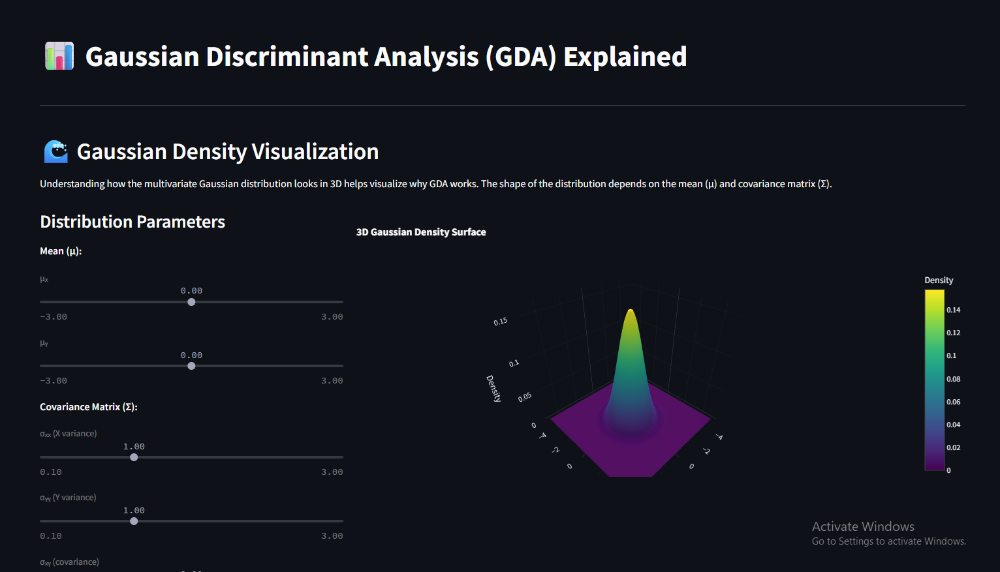

# Gaussian Discriminant Analysis with Joco



This project implements Gaussian Discriminant Analysis (GDA) (or Gaussian Naive Bayes) for classification tasks. It uses a generative model (Gaussian) to model the distribution of the features (x) given the class (y) (i.e. \( p(x|y) \)) and then uses Bayes' theorem to compute the posterior (i.e. \( p(y|x) \)) for classification.

## Installation

Ensure you have Python (>= 3.11) installed. Then, clone this repository and install the dependencies (listed in requirements.txt) as follows:

```bash
# Clone the repository (if applicable)
# git clone <your-repo-url>

# (Optional) Create a virtual environment (e.g. using venv)
# python -m venv venv
# (Activate your virtual environment: on Windows, run venv\Scripts\Activate.ps1)

# Install dependencies from requirements.txt
pip install -r requirements.txt
```

## Usage

To run the demo (for example, a streamlit app), execute:

```bash
streamlit run app.py
```

(Note: If your entry point is named differently (e.g. main.py), adjust the command accordingly.)

## Dependencies

The project relies on the following libraries (see requirements.txt for details):

- matplotlib (>= 3.10.3)
- numpy (>= 2.3.0)
- pandas (>= 2.3.0)
- plotly (>= 6.1.2)
- scikit-learn (>= 1.7.0)
- scipy (>= 1.15.3)
- seaborn (>= 0.13.2)
- streamlit (>= 1.45.1)

## License

(Add your license information here.) 